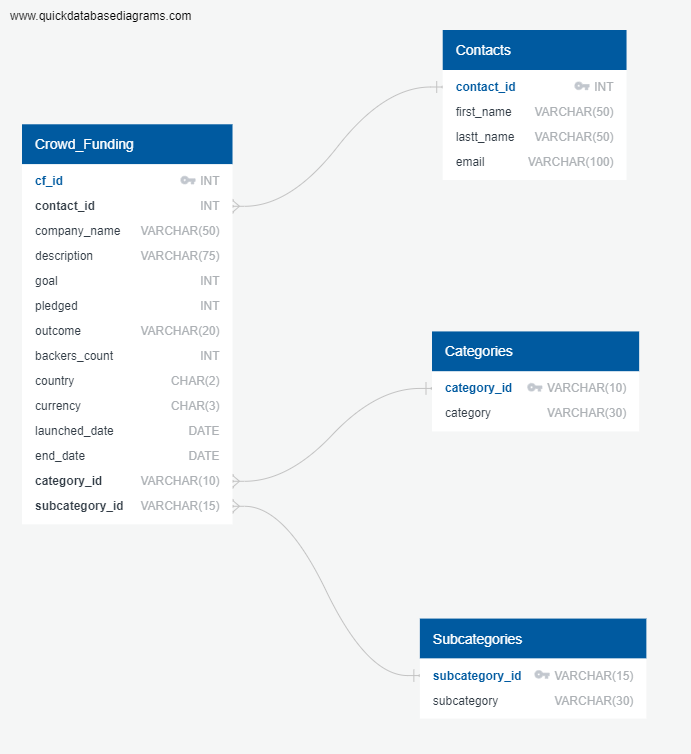
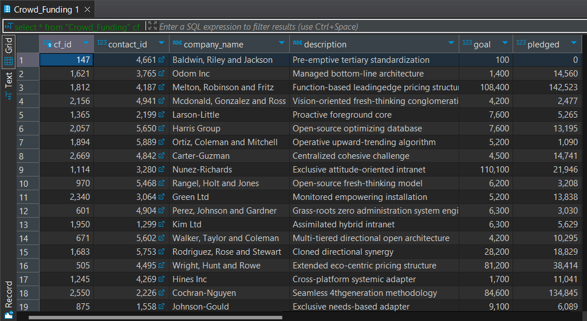
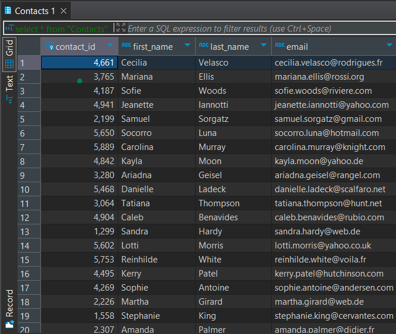
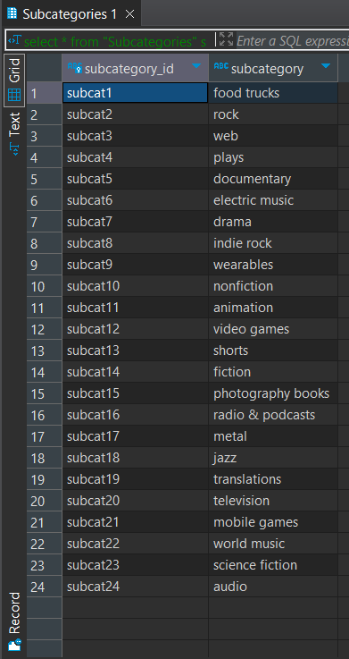
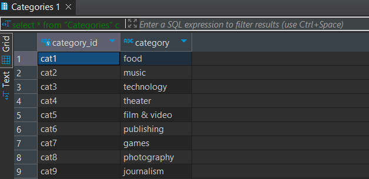

# ETL Project

## Project Overview
This project involved analyzing and transforming data from two Excel files, engineering a database model, then performing data extraction, transformation, and loading (ETL) using Python and DBeaver.

## Team Members
- Caite Green
- Sylvia Turner
- Alexander Seldon Jr
- Saad Nasir

## Tools and Technologies
- **Excel**: For initial data files.
- **QuickDBD**: For database modeling.
- **Python**: For data extraction and transformation.
- **Pandas**: Python library used for data manipulation.
- **DBeaver**: For database management and data loading.

## Project Steps

### 1. Data Extraction
- **Files Used**: Two Excel files (`crowdfunding.xlsx` and `contacts.xlsx`).
- **Tools**: Pandas library in Python.

### 2. Data Transformation
- **Objective**: Clean and prepare the data for database import.
- **Tools**: Pandas for data manipulation and transformation.

#### Sample Transformation Code:
```python
campaign_df = campaign_df.merge(category_df, on='category', how='left')

campaign_df = campaign_df.merge(subcategory_df, on='subcategory', how='left')

campaign_cleaned = campaign_df.drop(columns=['staff_pick', 'spotlight', 'category', 'subcategory'])

campaign_cleaned.to_csv("resources/campaign.csv", index=False)
```

### 3. Database Model Design
- **Tool Used:** QuickDBD.
- **Description:** Designed the database schema to fit the cleaned data structure.

### Database Schema


### 4. Exporting Clean CSVs
- **Objective:** Export the transformed data to CSV files for database import.
- **Tool:** Pandas.

### 5. Database Import
- **Objective:** DBeaver.
- **Tool:** Imported the clean CSV files into the database.

#### Steps in DBeaver
- Open DBeaver and connect to your database.
- Use the 'Data Import' wizard to import the cleaned_data.csv.
- Verify the data import by querying the database.

```sql
select * from "Categories" c; 

select * from "Contacts" cn;

select * from "Crowd_Funding" cf;

select * from "Subcategories" s;
```





## Conclusion
This project successfully implemented a complete ETL pipeline, starting from data extraction from excel files to transforming the data using Python and Pandas, and finally loading the cleaned data into a database using DBeaver. Throughout this process, we designed a normalized database schema and ensured the data was thoroughly cleaned and prepared for further analysis. The transformed data is now well-structured and ready for whatever the use-case might present.

## Future Work
While this project laid a strong foundation for data management and analysis, there are several areas for future work:

1. **Automation of ETL Process**: Develop scripts or use ETL tools to automate the ETL process, ensuring regular and efficient updates to the database.
2. **Integration with Other Data Sources**: Expand the database by integrating additional data sources, such as API data, real-time streaming data, or other databases, to enrich the dataset. 
3. **Optimization and Scaling**: Optimize the database for performance and scalability to handle larger datasets and more complex queries as the amount of data grows.

By addressing these future work areas, we can further enhance the capabilities of our data infrastructure, enabling more comprehensive and impactful analysis.


